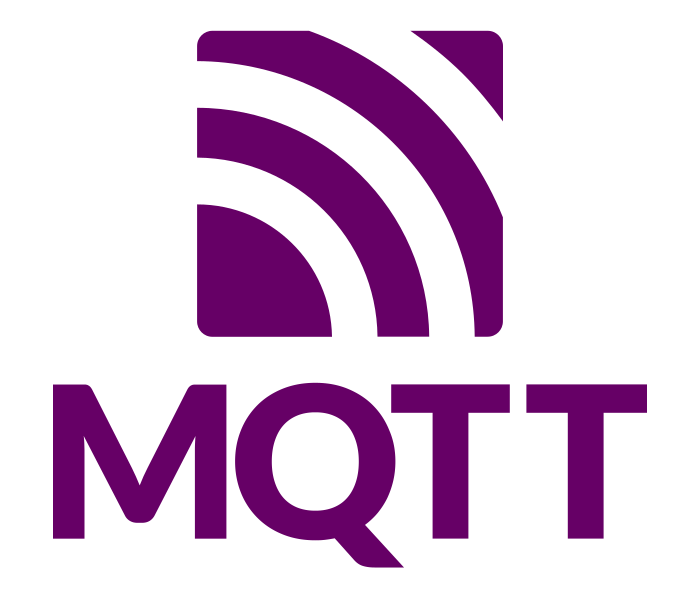
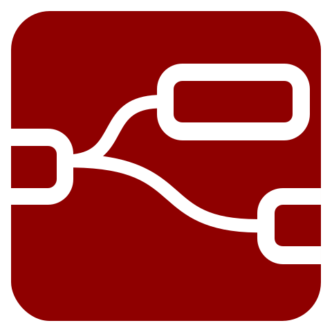

Welcome to my github page!

I build software which runs complex and interactive contraptions for escape room games, edutainment projects, interactive museums and control systems for game masters. I keep abreast with current and emerging methods and technologies by researching and finding new ways of stacking concurrent operations to implement in real-life gaming and entertainment systems. I am humbled that my work brings unforgettable experience and joy for the players of my games.

The most interesting projects I took part in are: 

Kidzania Dallas (as a lead gaming equipment engineer)
https://www.youtube.com/watch?v=UvsGKih4Tk8
A 80,000 sq. ft. city for kids to play and learn the real life professions. There are more than fifty establishments with interactive edutainment activities. 
— I took part in development of electrical plans, collaborated with the team on engineering solutions of created interactive scenarios, created RFPs on equipment production and tested software and gaming equipment.

Amazing Castle Singapore (as a lead software developer)
https://www.youtube.com/watch?v=invKiZBCdkY
A total of 9 arcade-style minigames with a scoreboard to display top teams. 
— Here I have designed and implemented the distributed system, including a server PC, two game operator PCs, 10 Arduinos and 15 Raspberry Pi working together as a non-blocking entertainment facility with a maximum capacity of 30 players or 9 teams. This project was a big challenge to implement my IOT skills I developed in while creating the escape room gaming systems.

Game Point Escape room center Barcelona (as a lead engineer)
https://www.youtube.com/watch?v=dMEOm5OGk5Y
Two story facility with a total of 16 escape rooms
— On this project, my responcibility was to create all the electronics for 14 escape rooms, pass the comissioning before delivery and to make sure that everything works after installation on site. Prior to installation I created wire plans in collaboration with architect, designed centralised control boxes that united gaming electronics within one room and managed the engineers developing the remote-control units for game masters.

